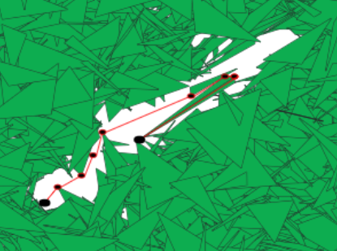
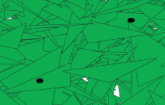
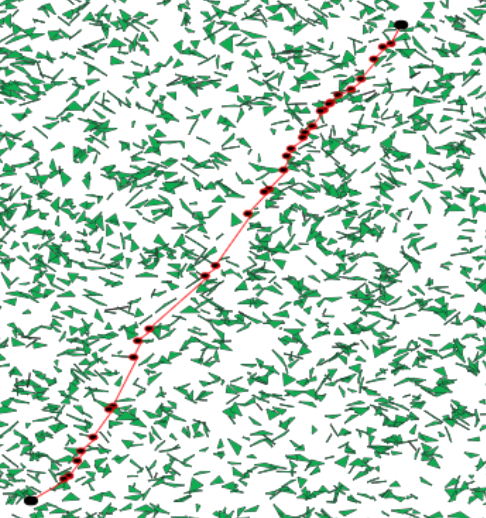
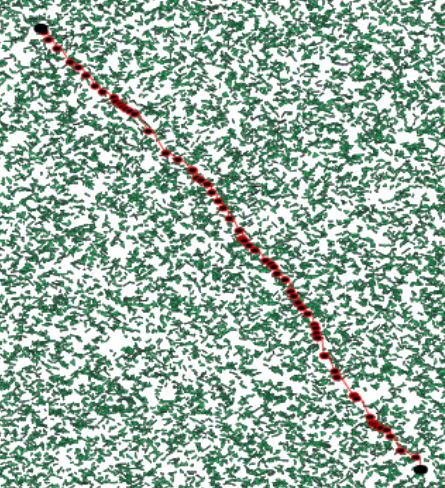

# Reply Code Challenge 2018

Solution for training problem of [Reply Code Challenge](https://challenges.reply.com)

## Points
- Input 1: **227**
- Input 2: **0** (Impossible)
- Input 3: **165**
- Input 4: **71**

## Visualization

#### Input 1

#### Input 2

#### Input 3

#### Input 4

